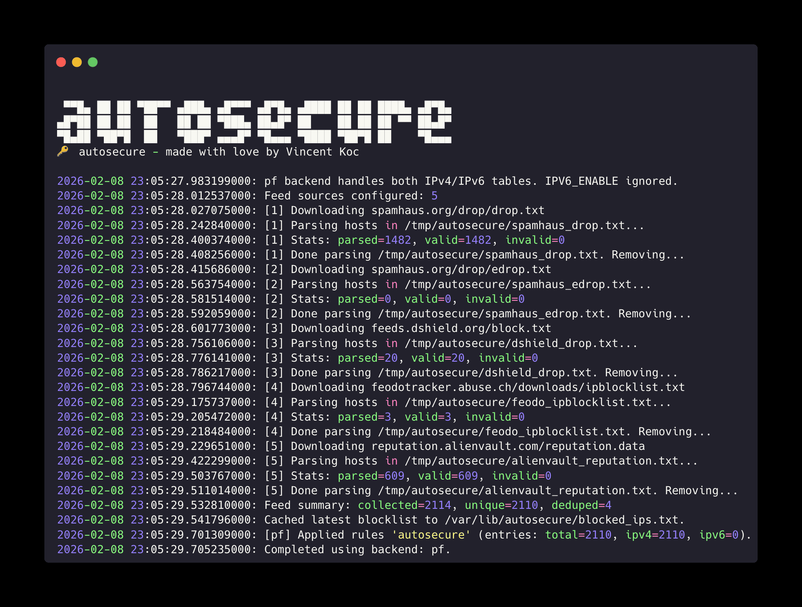

<h1 align="center">🔑 Autosecure</h1>

<p align="center">
  <strong>Public threat-feed and blocklists to automatic IP blocking for Linux and macOS firewalls.</strong>
</p>

<p align="center">
  <a href="https://github.com/vincentkoc/autosecure/actions/workflows/validation.yml"></a>
  <a href="https://github.com/vincentkoc/autosecure/releases"></a>
  <a href="https://github.com/vincentkoc/autosecure/blob/master/LICENSE.md"></a>
  
</p>

<p align="center">
  
</p>

## Why Autosecure?

Threat feeds and blocklists are useful, but manually translating them into firewall rules is repetitive and fragile. Autosecure handles download, parsing, validation, and rule refresh in one script with backend support for `iptables`, `firewalld`, `ufw`, `nft`, and `pf` (macOS). This package is based on [spamhaus script](https://github.com/cowgill/spamhaus) and contributors which has not been maintained in over 10 years. I have since extended its functionality beyond the original script.

Autosecure is very lightweight and can be setup to run daily on a cron to auto-update, its designed to not impact any existing firewall rules and will manage its own set. It's a perfect set and forget to protect any machine from bad actors.

## Install Autosecure Package

<details>
<summary>Homebrew (macOS)</summary>

```bash
brew tap vincentkoc/homebrew-tap
brew install autosecure
```

</details>

<details>
<summary>APT (Debian/Ubuntu)</summary>

```bash
curl -1sLf 'https://dl.cloudsmith.io/public/vincentkoc/autosecure/setup.deb.sh' | sudo -E bash
sudo apt-get update
sudo apt-get install autosecure
```

</details>

<details>
<summary>RPM (RHEL/Fedora)</summary>

```bash
curl -1sLf 'https://dl.cloudsmith.io/public/vincentkoc/autosecure/setup.rpm.sh' | sudo -E bash
sudo dnf install autosecure
```

</details>

<details>
<summary>Script only</summary>

```bash
curl -fsSL -o autosecure.sh https://raw.githubusercontent.com/vincentkoc/autosecure/master/autosecure.sh
chmod +x autosecure.sh
sudo ./autosecure.sh
```

</details>

## Current Feed Sources

- `https://www.spamhaus.org/drop/drop.txt`
- `https://www.spamhaus.org/drop/edrop.txt`
- `https://feeds.dshield.org/block.txt`
- `https://feodotracker.abuse.ch/downloads/ipblocklist.txt`
- `https://reputation.alienvault.com/reputation.data`

Additional URLs to parse can be passed in using the enviroment variable `AUTOSECURE_EXTRA_FEEDS` as comma seperated strings. Just a note the `ZeusTracker` feed is intentionally disabled because the endpoint is no longer available.

If you want to discover more sources, see: [threatfeeds.io](https://threatfeeds.io/)

## What You Get

- Firewall backend auto-detection: `iptables`, `firewalld`, `ufw`, `nftables`, `pf`
- IPv4 blocklist ingestion with optional IPv6 support (`ip6tables`)
- Optional `ipset` acceleration for large lists
- Safe refresh flow with cached fallback if feeds fail
- Quiet cron-friendly mode

## Configuration

### Environment variables

- `AUTOSECURE_FIREWALL_BACKEND=auto|iptables|firewalld|ufw|nft|pf` (default: `auto`)
- `AUTOSECURE_RULE_POSITION=append|top` (default: `append`)
- `AUTOSECURE_XTABLES_WAIT=<seconds>` (default: `5`)
- `AUTOSECURE_IPV6_ENABLE=0|1` (default: `0`)
- `AUTOSECURE_IPSET_ENABLE=0|1` (default: `0`)
- `AUTOSECURE_EXTRA_FEEDS=<url1,url2,...>`
- `AUTOSECURE_EGF=0|1` (default: `1`)


### Force a backend:

```bash
sudo AUTOSECURE_FIREWALL_BACKEND=pf autosecure.sh -q
sudo AUTOSECURE_FIREWALL_BACKEND=nft autosecure.sh -q
sudo AUTOSECURE_FIREWALL_BACKEND=iptables autosecure.sh -q
sudo AUTOSECURE_FIREWALL_BACKEND=firewalld autosecure.sh -q
sudo AUTOSECURE_FIREWALL_BACKEND=ufw autosecure.sh -q
```

### Scheduled Updates via Cron

<details>
<summary>Linux (APT/RPM/package install)</summary>

Use the packaged binary path:

```bash
crontab -e
0 3 * * * /usr/local/bin/autosecure -q
```

</details>

<details>
<summary>macOS (Homebrew install)</summary>

Use the Homebrew-installed binary path:

```bash
crontab -e
0 3 * * * /opt/homebrew/bin/autosecure -q
```

If you are on Intel macOS Homebrew, use:

```bash
0 3 * * * /usr/local/bin/autosecure -q
```

</details>

<details>
<summary>Script-only install (any OS)</summary>

Use the absolute path where you placed the script:

```bash
crontab -e
0 3 * * * /absolute/path/to/autosecure.sh -q
```

Resolve the executable path first:

```bash
command -v autosecure || command -v autosecure.sh
```

</details>

## Troubleshooting

<details>
<summary>iptables (IPv4)</summary>

Flush chains:

```bash
sudo iptables -F Autosecure
sudo iptables -F AutosecureAct
```

Detach chain jumps:

```bash
sudo iptables -D INPUT -j Autosecure
sudo iptables -D FORWARD -j Autosecure
sudo iptables -D OUTPUT -j Autosecure
```

Delete chains:

```bash
sudo iptables -X Autosecure
sudo iptables -X AutosecureAct
```

</details>

<details>
<summary>ip6tables (IPv6 mode)</summary>

If `AUTOSECURE_IPV6_ENABLE=1` was used, clear IPv6 chains similarly:

```bash
sudo ip6tables -F Autosecure
sudo ip6tables -F AutosecureAct
sudo ip6tables -D INPUT -j Autosecure
sudo ip6tables -D FORWARD -j Autosecure
sudo ip6tables -D OUTPUT -j Autosecure
sudo ip6tables -X Autosecure
sudo ip6tables -X AutosecureAct
```

</details>

<details>
<summary>nftables backend</summary>

Inspect table:

```bash
sudo nft list table inet autosecure
```

Remove table:

```bash
sudo nft delete table inet autosecure
```

</details>

<details>
<summary>macOS pf backend</summary>

How it works on macOS:

- Backend `auto` selects `pf`.
- On first run, `/etc/pf.conf` is auto-bootstrapped with:
  - `anchor "autosecure"`
  - `load anchor "autosecure" from "/etc/pf.anchors/autosecure"`
- Runtime rules are loaded into anchor `autosecure` and table `autosecure_bad_hosts`.
- Common noisy `pfctl -f` warnings are filtered, while real `pfctl` errors are still shown.

Inspect anchor and table:

```bash
sudo pfctl -a autosecure -s rules
sudo pfctl -a autosecure -t autosecure_bad_hosts -T show
```

Flush block table entries:

```bash
sudo pfctl -a autosecure -t autosecure_bad_hosts -T flush
```

Reload anchor file:

```bash
sudo pfctl -a autosecure -f /etc/pf.anchors/autosecure
```

Validate main pf config if needed:

```bash
sudo pfctl -nf /etc/pf.conf
```

</details>

## Contributing

Open an issue for bugs or a pull request for improvements.

---

Made with 💙 by <a href="https://github.com/vincentkoc">Vincent Koc</a> · <a href="LICENSE">GPL-3.0</a>
